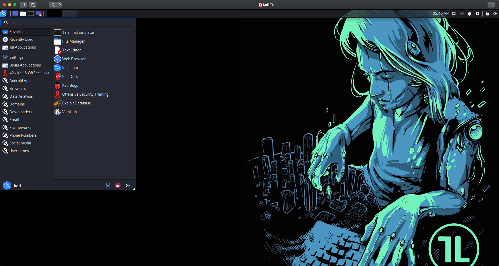

# Trace Labs Kali Linux

## Overview

The repository includes a recipe file to build a Linux OSINT Distribution for Trace Labs based on Kali Linux.

## OVA Download

We have set up Version 1.0 of this build in an OVA for you to easily try out. To get started, download the OVA file via the link below and run it in your choice of VM software (ie. VMware Workstation, Virtualbox etc.). The default credentials to log in to the TL OSINT VM are **osint:osint**

https://www.tracelabs.org/initiatives/osint-vm

## Applications Included

**Browsers**
* Firefox ESR
* Tor Browser

**Data Analysis**
* DumpsterDiver
* Exifprobe
* Exifscan
* Stegosuite

**Domains**
* Domainfy (OSRFramework)
* Sublist3r

**Downloaders**
* Browse Mirrored Websites
* Metagoofil
* Spiderpig
* WebHTTrack Website Copier
* Youtube-DL

**Email**
* Buster
* Checkfy (OSRFramework)
* Infoga
* Mailfy (OSRFramework)
* theHarvester
* h8mail

**Frameworks**
* Little Brother
* OSRFramework
* sn0int
* Spiderfoot
* Maltego
* OnionSearch

**Phone Numbers**
* Phonefy (OSRFramework)
* PhoneInfoga

**Social Media**
* Instaloader
* Twint
* Searchfy (OSRFramework)
* Tiktok Scraper

**Usernames**
* Alias Generator (OSRFramework)
* Sherlock
* Usufy (OSRFramework)

**Other tools
* Photon
* Sherlock
* Shodan

## Configuration Settings

**Firefox**
* Delete cookies/history on shutdown
* Block geo tracking
* Block mic/camera detection
* Block Firefox tracking
* Preload OSINT Bookmarks

## References:

* https://docs.kali.org/development/live-build-a-custom-kali-iso
* https://github.com/prateepb/kali-live-build